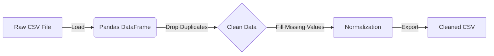

# 📥 Module 1: Data Ingestion & Normalization

**Status:** ✅ Active | **Tech:** Pandas, Python

This module serves as the **Data Entry Point** for the entire Enterprise Intelligence system. It is responsible for loading raw support tickets, cleaning inconsistencies, and producing a standardized dataset that the NLP extraction module can reliably process.

---

## 🎯 Purpose & Goals

1.  **Ingest:** Load raw CSV data from the `data/raw/` directory.
2.  **Clean:** Remove duplicates, handle missing values (NaNs), and fix data types.
3.  **Normalize:** Standardize text fields (lowercase, strip whitespace) to ensure the Knowledge Graph doesn't create duplicate nodes (e.g., "Dell" vs "dell ").
4.  **Export:** Save the clean data to `data/processed/` for Module 2.

---

## ⚙️ Workflow



---

## 📂 File Structure

```bash
src/module1_ingestion/
├── __init__.py           # Makes this a Python package
├── normalize_tickets.py  # Main script for data cleaning
└── README.md             # This documentation

```

---

## 🚀 How to Run

Execute this module from the **root directory** of the project:

```bash
python -m src.module1_ingestion.normalize_tickets

```

**Expected Output:**

```text
Loading data from data/raw/customer_support_tickets.csv...
✅ Data Loaded. Rows: 100
Cleaning and Normalizing...
✅ Success! Cleaned data saved to data/processed/cleaned_support_tickets.csv

```

---

## 💻 Code Explanation

The core logic resides in `normalize_tickets.py`. Here is a breakdown of what happens under the hood:

### 1. Loading

We use `pandas` to read the source CSV.

```python
df = pd.read_csv(INPUT_FILE)

```

### 2. Cleaning Strategy

We apply a strict cleaning protocol to ensure graph quality:

* **Duplicates:** `df.drop_duplicates()` ensures we don't count the same ticket twice.
* **Missing Values:** We fill `NaN` values in critical columns (like `Ticket Description`) with a placeholder like "Unknown" so the pipeline doesn't crash.
* **Date Parsing:** Converts string dates to Python `datetime` objects for time-based queries later.

### 3. Text Normalization

To prevent "Ghost Nodes" (duplicate nodes for the same entity) in Neo4j, we normalize strings:

```python
# Example logic used
df['product_purchased'] = df['product_purchased'].str.strip()
df['ticket_description'] = df['ticket_description'].str.lower()

```

---

## 🛠️ Configuration & Customization

If you want to use your own dataset, follow these steps:

1. **Replace the File:** Put your new CSV file in `data/raw/`.
2. **Update Path:** Open `normalize_tickets.py` and change the `INPUT_FILE` constant:
```python
INPUT_FILE = os.path.join(DATA_DIR, 'raw', 'your_new_file.csv')

```


3. **Adjust Columns:** If your CSV has different column names (e.g., "issue_text" instead of "ticket_description"), update the column references in the script.

---

## 🔗 Next Steps

Once this module runs successfully, the clean data is ready for **Entity Extraction**.
👉 **[Go to Module 2: Entity Extraction](../module2_extraction/README.md)**
