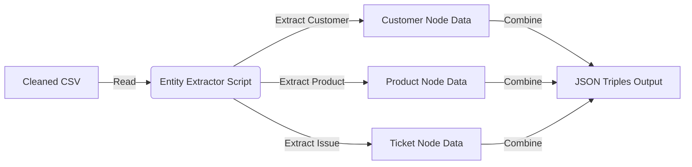

# ⛏️ Module 2: Entity Extraction & Structuring

**Status:** ✅ Active | **Tech:** Python, NLP (Keyword/Regex), JSON

This module is the **Knowledge Extractor**. It bridges the gap between raw text tables and the Graph Database. It reads the normalized CSV data from Module 1 and converts it into a structured **JSON format** containing "Entities" (People, Products) and "Relationships" (Raised, About).

---

## 🎯 Purpose & Goals

1.  **Parse:** Read the `cleaned_support_tickets.csv`.
2.  **Identify:** Detect key entities in the text:
    * **Customer** (Name, Age, Gender, Email)
    * **Product** (Model Name)
    * **Ticket** (Issue Description, Priority, Status)
3.  **Structure:** Format these findings into **Triples** (Subject $\rightarrow$ Predicate $\rightarrow$ Object) inside a JSON file.
4.  **Prepare:** Output `extracted_triples.json` for the Graph Builder (Module 3).

---

## ⚙️ Workflow



---

## 📂 File Structure

```bash
src/module2_extraction/
├── __init__.py           # Package marker
├── entity_extractor.py   # Main extraction logic
└── README.md             # This documentation

```

---

## 🚀 How to Run

Execute this module from the **root directory**:

```bash
python -m src.module2_extraction.entity_extractor

```

**Expected Output:**

```text
Data Loaded. Processing 100 rows...
✅ Success! Processed 100 records.
Saved to: data/processed/extracted_triples.json

```

---

## 🧠 Logic: From Rows to Objects

The script `entity_extractor.py` doesn't just copy data; it **remodels** it for the graph.

### 1. The Mapping Strategy

We map flat CSV columns to Graph Concepts:

| CSV Column | Graph Concept | Property |
| --- | --- | --- |
| `Customer Name` | **Node: Customer** | `.name` |
| `Customer Age` | **Node: Customer** | `.age` |
| `Product Purchased` | **Node: Product** | `.name` |
| `Ticket Type` | **Node: Ticket** | `.root_cause` |
| `Ticket Description` | **Node: Ticket** | `.description` |

### 2. The JSON Structure

The output is a list of dictionaries, where each dictionary represents a **complete graph subgraph** (One Ticket + One Customer + One Product).

**Example Output (`extracted_triples.json`):**

```json
[
    {
        "ticket_id": "1001",
        "customer_name": "Ayush Dubey",
        "customer_age": 25,
        "product_purchased": "Dell XPS",
        "ticket_description": "screen flickering when charging",
        "root_cause": "Hardware",
        "sentiment": "Negative"
    },
    ...
]

```

---

## 🛠️ Customization & Advanced NLP

Currently, this module uses **Structured Extraction** (mapping known columns). To make it more intelligent in the future:

1. **Add SpaCy/NER:** You can upgrade `entity_extractor.py` to use `spacy` to automatically find product names inside the *description text* if the "Product" column is missing.
```python
import spacy
nlp = spacy.load("en_core_web_sm")
# Logic to extract entities from 'ticket_description'

```


2. **Sentiment Analysis:** You can add a library like `TextBlob` or `VADER` here to auto-calculate the "Sentiment" field based on how angry the customer sounds in the description.

---

## 🔗 Next Steps

Now that we have structured JSON data, we are ready to inject it into the Graph Database.
👉 **[Go to Module 3: Graph Construction](../module3_graph_construction/README.md)**
