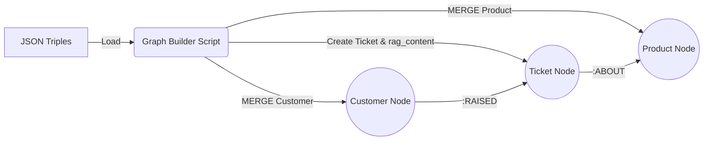

# 🏗️ Module 3: Knowledge Graph Construction

**Status:** ✅ Active | **Tech:** Neo4j, Cypher, Python Driver

This module is the **Builder**. It takes the static JSON data produced in Module 2 and brings it to life inside the **Neo4j Graph Database**. It transforms flat records into a dynamic network of connected nodes, enabling relationship-based queries.

---

## 🎯 Purpose & Goals

1.  **Connect:** Establish a secure connection to your Neo4j AuraDB instance.
2.  **Model:** Implement the Graph Schema:
    * **Nodes:** `Customer`, `Product`, `Ticket`
    * **Relationships:** `(Customer)-[:RAISED]->(Ticket)`, `(Ticket)-[:ABOUT]->(Product)`
3.  **Enrich:** Create the **`rag_content`** super-field. This is a crucial step that combines all context (Who, What, Why) into a single text property, allowing the AI to "read" the full story of a ticket in one go.
4.  **Load:** Efficiently push 100+ records into the database without creating duplicates (using `MERGE`).

---

## ⚙️ Workflow



---

## 📂 File Structure

```bash
src/module3_graph_construction/
├── __init__.py           # Package marker
├── graph_builder.py      # Main database population script
└── README.md             # This documentation

```

---

## 🚀 How to Run

**Prerequisite:** Ensure your `.env` file has the correct `NEO4J_URI`, `NEO4J_USER`, and `NEO4J_PASSWORD`.

Execute this module from the **root directory**:

```bash
python -m src.module3_graph_construction.graph_builder

```

**Expected Output:**

```text
🔄 Connecting to Neo4j... Processing 100 records.
✅ Processed Ticket #1001
✅ Processed Ticket #1002
...
🎉 Graph Built Successfully!

```

---

## 🧠 Logic: The "Rich Context" Strategy

The most important part of this code is how we handle **RAG Context**. A simple graph isn't enough for an LLM; it needs narrative.

In `graph_builder.py`, we construct a special field called `rag_content` for every ticket:

```python
# The "Super-Field" for AI
rich_context = (
    f"Ticket ID: {item['ticket_id']}. "
    f"Customer Demographics: {item['customer_age']} year old {item['customer_gender']}. "
    f"Product: {item['product_purchased']}. "
    f"Issue Description: {item['ticket_description']}. "
    f"Root Cause: {item.get('root_cause', 'Unknown')}."
)

```

**Why do we do this?**
When the AI searches for "issues with Dell XPS," it finds this single block of text. Because the text *also* contains the customer's age and gender, the AI instantly knows the demographics without needing to perform complex multi-hop graph queries. It solves the "Disconnect Problem."

---

## 📊 Visualization (Cypher Queries)

Once the script finishes, open your **Neo4j Aura Console** and run these queries to verify your work:

### 1. View the "Star" Topology

See how multiple customers connect to a single popular product.

```cypher
MATCH (p:Product {name: 'Dell XPS'})<-[:ABOUT]-(t:Ticket)<-[:RAISED]-(c:Customer)
RETURN p, t, c LIMIT 50;

```

### 2. Check for "High Priority" Issues

```cypher
MATCH (t:Ticket {priority: 'High'})-[:ABOUT]->(p:Product)
RETURN p.name, t.description, t.rag_content;

```

### 3. Verify the Schema

```cypher
CALL db.schema.visualization();

```

---

## 🛠️ Customization

* **Adding New Properties:** If you extracted new fields in Module 2 (e.g., `Sentiment`), add them to the `SET` clause in the `_create_nodes_and_relationships` function.
* **Changing Relationships:** You can modify the Cypher queries to add new relationship types, such as `(Customer)-[:OWNS]->(Product)` if you had purchase history data.

---

## 🔗 Next Steps

The graph is built, but it's "silent." We need to give it a voice by indexing it for the AI.
👉 **[Go to Module 4: RAG & Vector Indexing](../module4_rag/README.md)**
