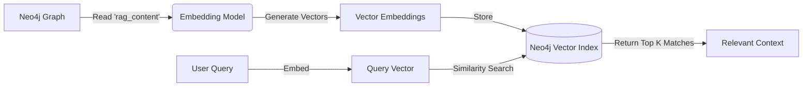

# 🧠 Module 4: RAG & Vector Indexing

**Status:** ✅ Active | **Tech:** LangChain, Neo4j Vector, Sentence-Transformers

This module builds the **"Semantic Brain"** of the system. It transforms the text stored in the Knowledge Graph into mathematical vectors (embeddings), enabling the AI to understand the *meaning* of data, not just keyword matches. This is the core of the Retrieval-Augmented Generation (RAG) pipeline.

---

## 🎯 Purpose & Goals

1.  **Embed:** Use a pre-trained AI model (`sentence-transformers/all-MiniLM-L6-v2`) to convert the `rag_content` of every ticket into a vector.
2.  **Index:** Create a **Vector Index** (`ticket_description_vector`) inside Neo4j. This allows the database to perform "Similarity Search."
3.  **Retrieve:** Provide search functionality where the system can find "the most relevant tickets" for a user's fuzzy question (e.g., "Why are batteries dying?" -> finds "Battery drain issue").

---

## ⚙️ Workflow



---

## 📂 File Structure

```bash
src/module4_rag/
├── __init__.py               # Package marker
├── create_vector_index.py    # Script to build/refresh the index
├── test_retrieval.py         # Debug script to test search manually
└── README.md                 # This documentation

```

---

## 🚀 How to Run

### 1. Build the Index (The "Refresh" Button)

Run this command **every time** you add new data to the graph (Module 3). If you don't run this, the AI won't know about the new tickets.

```bash
python -m src.module4_rag.create_vector_index

```

**Expected Output:**

```text
⏳ Loading Embedding Model...
🔄 Connecting to Neo4j to build the Index...
✅ Success! Vector Index 'ticket_description_vector' created.

```

### 2. Test the Brain (Debug Mode)

Before launching the dashboard, check if the search is working correctly.

```bash
python -m src.module4_rag.test_retrieval

```

*(This script runs a sample query like "Dell XPS" and prints the raw text the AI finds. Use it to verify that the `rag_content` is being retrieved correctly.)*

---

## 🧠 Logic: Vector Search Configuration

The core configuration happens in `create_vector_index.py`.

* **Model:** `all-MiniLM-L6-v2` (Fast, lightweight, efficient for CPU).
* **Target Node:** `Ticket`
* **Target Property:** `rag_content` (The super-field we built in Module 3).
* **Index Name:** `ticket_description_vector`

```python
vector_store = Neo4jVector.from_existing_graph(
    embedding=embeddings,
    index_name="ticket_description_vector",
    node_label="Ticket",
    text_node_properties=["rag_content"], # <--- CRITICAL: Must match Module 3
    embedding_node_property="embedding",
)

```

---

## 🛠️ Troubleshooting: "Ghost Index"

**Problem:** You updated the data, but the AI is giving old answers.
**Cause:** Neo4j sometimes re-uses an old index instead of rebuilding it.

**Solution (The "Nuclear" Fix):**

1. Open **Neo4j Aura Console**.
2. Run this Cypher command to delete the old index:
```cypher
DROP INDEX ticket_description_vector;

```


3. Re-run the python script:
```bash
python -m src.module4_rag.create_vector_index

```


---

## 🔗 Next Steps

The brain is built and the index is ready. Now we need a user interface to interact with it.
👉 **[Go to Module 5: Enterprise Dashboard](../module5_dashboard/README.md)**
